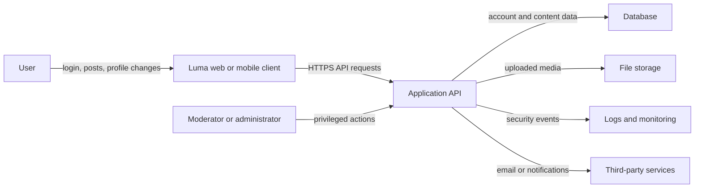

# Luma Data Flow

This provisional data flow should be revised after confirming the implementation.

## Trust boundaries

- The user-controlled client cannot be trusted to enforce authorization.
- All traffic crossing the internet should use encryption.
- Uploaded content crosses from an untrusted user into application-controlled storage.
- Administrative actions require stronger protection and monitoring.
- Data shared with third-party services leaves Luma's direct control.

## Sensitive data to identify

- Password hashes and authentication tokens
- Email addresses and account-recovery information
- Private profiles, posts, and messages
- User-uploaded media and metadata
- IP addresses and security logs
- Administrative records and moderation history

